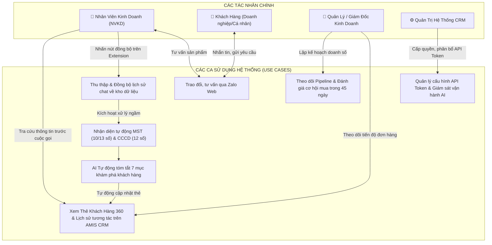
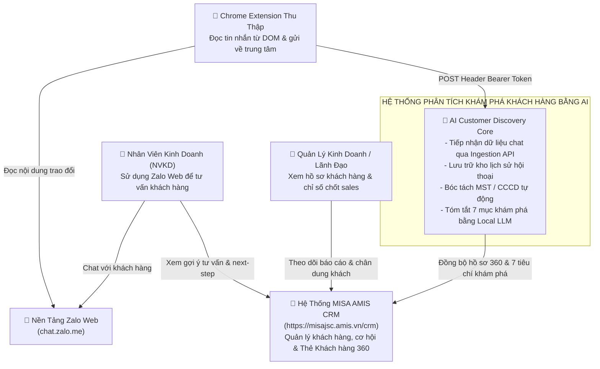
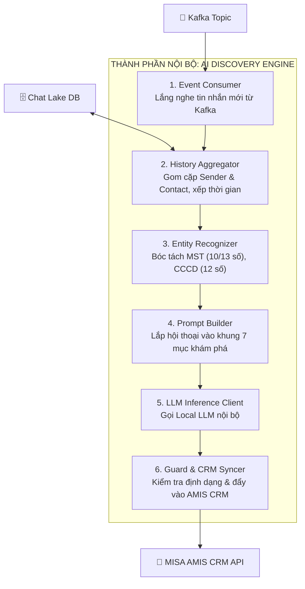
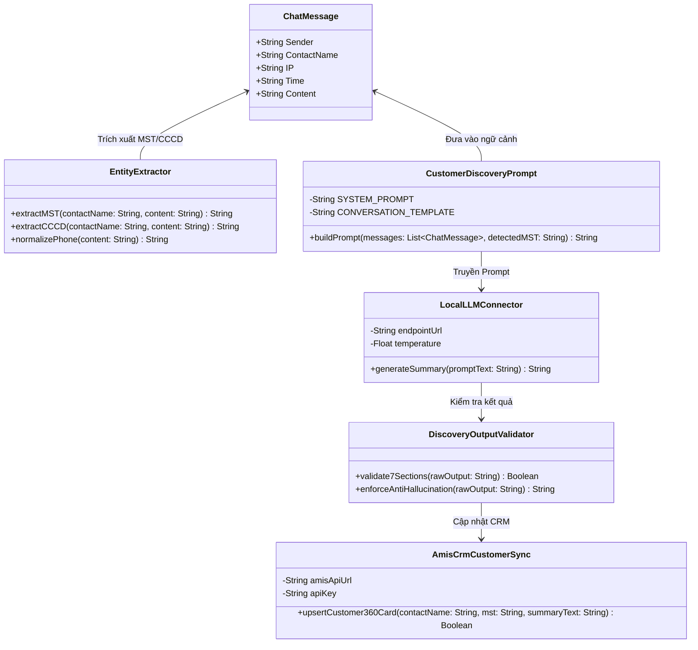
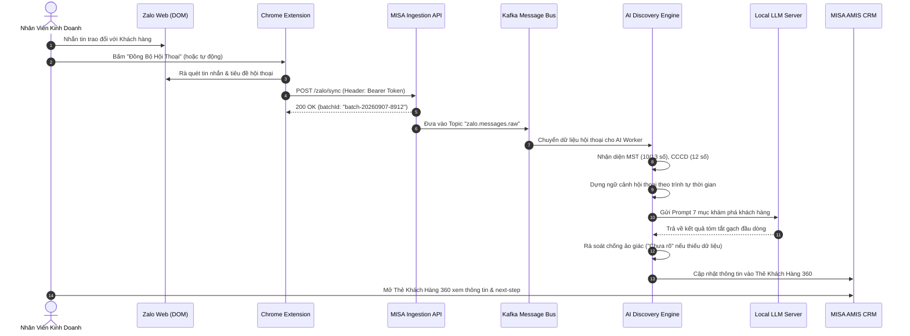

# TỔNG THỂ KIẾN TRÚC HỆ THỐNG: KHÁM PHÁ KHÁCH HÀNG TỰ ĐỘNG BẰNG AI TỪ HỘI THOẠI ZALO
**Tích Hợp Với Hệ Thống MISA AMIS CRM (`https://misajsc.amis.vn/crm`)**

---

## 1. TỔNG QUAN GIẢI PHÁP VÀ BỐI CẢNH NGHIỆP VỤ

### 1.1. Mục Tiêu Cốt Lõi
Trong hoạt động bán hàng B2B và B2C tại Việt Nam, phần lớn việc trao đổi, tư vấn giữa **Nhân viên Kinh doanh (NVKD)** và **Khách hàng** diễn ra trên Zalo. Tuy nhiên:
- Dữ liệu trao đổi bị phân tán trên máy trạm của từng NVKD, tổ chức không lưu trữ và quản lý tập trung được.
- NVKD tốn nhiều thời gian ghi chép biên bản hoặc quên cập nhật thông tin khách hàng vào CRM.
- Lãnh đạo và Quản lý Kinh doanh không nắm bắt được kịp thời nhu cầu thật sự, mức độ cấp thiết và chân dung của khách hàng.

**Giải pháp toàn diện:**
Xây dựng một hệ sinh thái khép kín từ **Thu thập dữ liệu chat** $\rightarrow$ **Kho lưu trữ tập trung** $\rightarrow$ **AI Phân tích & Tóm tắt Chân dung Khách hàng** $\rightarrow$ **Cập nhật tự động vào MISA AMIS CRM**.
Trong hệ thống này, **Chrome Extension chỉ là một thành phần trung gian thu thập dữ liệu ở tầng ngoại vi (Edge Capture Agent)**. Trái tim của giải pháp là **Hệ Thống Phân Tích Khám Phá Khách Hàng Bằng Trí Tuệ Nhân Tạo (AI Customer Discovery Engine)** chạy on-premise/private cloud, tự động biến dữ liệu chat rời rạc thành các trường thông tin chuẩn mực giúp tăng tỷ lệ chốt sales.

---

### 1.2. Sơ Đồ Ca Sử Dụng Nghiệp Vụ (Use Case Diagram)



---

## 2. BỘ SƠ ĐỒ KIẾN TRÚC C4 TOÀN DIỆN (4 CẤP ĐỘ)

Bộ sơ đồ C4 mô hình hóa toàn bộ giải pháp từ góc nhìn bối cảnh nghiệp vụ tổng thể đến cấu trúc thành phần và chi tiết thuật toán mã nguồn.

### 2.1. C4 Level 1: System Context Diagram (Bối Cảnh Hệ Thống)
*Xem sơ đồ tương tác đồ họa cao cấp tại file: [c4-level1-context.html](file:///d:/Github/Zalo_ext/docs/architecture/c4-level1-context.html)*



---

### 2.2. C4 Level 2: Container Diagram (Kiến Trúc Tầng Ứng Dụng & Dịch Vụ)
*Xem sơ đồ tương tác đồ họa cao cấp tại file: [c4-level2-container.html](file:///d:/Github/Zalo_ext/docs/architecture/c4-level2-container.html)*

Toàn bộ hệ sinh thái gồm 6 Container phối hợp đồng bộ:
1. **Chrome Extension (Client Agent)**: Nhúng tại máy trạm Sales, gom tin nhắn và đẩy qua HTTP Header Bearer Token.
2. **Ingestion API Gateway (Domain: `https://misajsc.amis.vn/crm`)**: Cửa ngõ bảo mật tiếp nhận dữ liệu, xác thực quyền NVKD.
3. **Message Queue Bus (Apache Kafka / RabbitMQ)**: Bộ đệm thông điệp giúp hệ thống chịu tải cao, không làm tắc nghẽn API.
4. **Chat History Data Lake (PostgreSQL / MongoDB)**: Kho lưu trữ bền vững toàn bộ lịch sử trao đổi theo cặp `(Sender, ContactName)`.
5. **AI Discovery & Summarization Engine (Python/FastAPI Engine)**: Engine thông minh bóc tách MST/CCCD, dựng ngữ cảnh và điều phối suy luận AI.
6. **Local LLM Server (Ollama / vLLM on Private GPU)**: Cụm máy chủ suy luận mô hình ngôn ngữ lớn (Qwen-2.5 / Llama-3) chạy nội bộ, đảm bảo bảo mật 100% dữ liệu kinh doanh.
7. **MISA AMIS CRM Core Database & Frontend**: Nơi hiển thị thẻ khách hàng 360 và lưu hồ sơ kinh doanh.

```mermaid
flowchart LR
    Ext["🧩 Chrome Extension<br/>(Zalo Web Agent)"]
    Gateway["🛡️ Ingestion Gateway<br/>(https://misajsc.amis.vn/crm)"]
    Queue["📨 Message Queue<br/>(Kafka / Topic: zalo.raw)"]
    DataLake["🗄️ Chat History Lake<br/>(PostgreSQL/TimescaleDB)"]
    AIEngine["⚡ AI Discovery Engine<br/>(Python Orchestrator)"]
    LLM["🧠 Local LLM Cluster<br/>(vLLM / Ollama Private GPU)"]
    AMIS["🏢 MISA AMIS CRM<br/>(Khách Hàng 360 Profile)"]

    Ext -->|1. POST /zalo/sync (Header Bearer)| Gateway
    Gateway -->|2. Produce raw chat event| Queue
    Queue -->|3. Consume & Persist| DataLake
    DataLake -->|4. Pull full conversation| AIEngine
    AIEngine -->|5. Regex: MST / CCCD| AIEngine
    AIEngine -->|6. Prompt 7 mục khám phá| LLM
    LLM -->|7. Trả về kết quả tóm tắt| AIEngine
    AIEngine -->|8. Sync Hồ sơ Khách hàng| AMIS
```

---

### 2.3. C4 Level 3: Component Diagram (Chi Tiết Thành Phần Dịch Vụ AI Core)
*Xem sơ đồ tương tác đồ họa cao cấp tại file: [c4-level3-ai-core.html](file:///d:/Github/Zalo_ext/docs/architecture/c4-level3-ai-core.html)*

Bên trong **AI Discovery & Summarization Engine** gồm 6 module chuyên trách:
1. **Event Consumer**: Lắng nghe dữ liệu chat từ Message Queue.
2. **Contact & History Aggregator**: Nhóm tin nhắn theo cặp `(Sender, ContactName)`, sắp xếp thời gian chuẩn xác.
3. **Entity Recognizer (Regex & NLP)**: Tự động phát hiện MST (10 hoặc 13 chữ số) và CCCD (12 chữ số) trong tên liên hệ hoặc nội dung.
4. **Prompt & Context Builder**: Nạp lịch sử hội thoại vào khung Prompt 7 mục chuẩn hóa nghiệp vụ.
5. **LLM Inference Client**: Kết nối bảo mật tới cụm Local LLM với cơ chế retry và timeout.
6. **Output Guard & AMIS CRM Sync Agent**: Kiểm tra tính chuẩn tắc gạch đầu dòng, loại bỏ ảo giác, sau đó gọi REST API cập nhật Thẻ 360 vào MISA AMIS CRM.



---

### 2.4. C4 Level 4: Code & Detailed Module Design Diagram (Thiết Kế Chi Tiết Module Xử Lý)
Mô hình hóa cấu trúc lớp đối tượng và luồng hàm thực thi của bộ xử lý AI:



---

## 3. SƠ ĐỒ LUỒNG DỮ LIỆU & QUY TRÌNH THỰC THI (WORKFLOWS)

### 3.1. Luồng Dữ Liệu Tổng Thể End-to-End
*Xem sơ đồ tương tác đồ họa cao cấp tại file: [flow-end-to-end-pipeline.html](file:///d:/Github/Zalo_ext/docs/architecture/flow-end-to-end-pipeline.html)*



---

### 3.2. Quy Trình AI Xử Lý Tóm Tắt 7 Mục Khám Phá Khách Hàng
*Xem sơ đồ tương tác đồ họa cao cấp tại file: [flow-ai-discovery-process.html](file:///d:/Github/Zalo_ext/docs/architecture/flow-ai-discovery-process.html)*

Quy trình xử lý nội bộ của AI Engine được chuẩn hóa theo 5 bước nghiêm ngặt:
1. **Bước 1 - Phân nhóm dữ liệu**: Lấy tất cả tin nhắn cùng cặp `Sender` và `ContactName`, sắp xếp theo thứ tự thời gian tăng dần để đảm bảo mạch ngữ cảnh.
2. **Bước 2 - Nhận diện thực thể (Entity Recognition)**:
   - Quét `ContactName` và `Content` để tìm Mã Số Thuế (10 hoặc 13 chữ số) và CCCD (12 chữ số).
   - Tự động gắn nhãn MST nhận diện được vào đầu hồ sơ khách hàng.
3. **Bước 3 - Khởi tạo Prompt chuẩn**: Kết hợp ngữ cảnh hội thoại với quy tắc nghiệm ngặt (chỉ dùng dữ liệu trong chat, thiếu ghi "Chưa rõ").
4. **Bước 4 - Suy luận AI (Local LLM Inference)**: Chạy mô hình ngôn ngữ nội bộ với nhiệt độ thấp (`temperature = 0.1`) để đạt độ chính xác tối đa và loại bỏ hoàn toàn tính bịa đặt.
5. **Bước 5 - Đồng bộ Thẻ 360**: Ghi nhận kết quả vào trường `DiscoveryInsights` của Khách hàng trên `https://misajsc.amis.vn/crm`.

---

## 4. ĐẶC TẢ CHI TIẾT PROMPT 7 MỤC KHÁM PHÁ KHÁCH HÀNG

### 4.1. Cấu Trúc Prompt Chuẩn Cho AI
Engine AI sử dụng cấu trúc Prompt định hướng nghiệp vụ sau để tóm tắt cho từng cuộc hội thoại:

> **Nội dung Prompt hệ thống:**
> *"Đối với mỗi hội thoại của từng Sender và ContactName cần cập nhật, tóm tắt thông tin khám phá khách hàng theo cấu trúc sau (chỉ dùng dữ liệu có trong hội thoại, nếu thiếu ghi "Chưa rõ", viết ngắn gọn gạch đầu dòng):*
> - **1) Khách hàng**: MST, Tên khách hàng, Liên hệ chính: Họ tên, Chức danh, SĐT, Email. Trường hợp ContactName có bao gồm MST, CCCD hãy tự nhận diện. Lưu ý: MST gồm 10 hoặc 13 số, CCCD có 12 số.
> - **2) Quy mô nhân sự**: Quy mô số lượng nhân sự, Số lượng Phòng ban/chi nhánh.
> - **3) Hiện trạng**: Đang dùng phần mềm/hệ thống nào, Quy trình/cách làm hiện tại, Khó khăn vướng mắc, Khả năng mua trong 45 ngày kèm lý do.
> - **4) Tiêu chí chọn giải pháp**: Tiêu chí bắt buộc, Tiêu chí mong muốn, Tiêu chí về triển khai/tích hợp/bảo mật.
> - **5) Người quyết định/đầu mối**: Người dùng chính, Người ảnh hưởng, Người ra quyết định cuối, Người ký/duyệt ngân sách.
> - **6) Ngân sách**: Ngân sách dự kiến/khoảng ngân sách, Tình trạng ngân sách, Ghi chú.
> - **7) Cam kết / Next step**: Next step đã thống nhất, Thời gian dự kiến, Ai tham gia bước tiếp theo."*

### 4.2. Nguyên Tắc Chống Ảo Giác (Anti-Hallucination Guardrails)
- **Tuyệt đối không suy diễn**: Nếu khách hàng chưa đề cập đến ngân sách hay người quyết định, AI bắt buộc điền `"Chưa rõ"`.
- **Trích dẫn có căn cứ**: Mọi thông tin về phần mềm đang dùng hoặc khả năng mua trong 45 ngày đều phải gắn liền với phát biểu thực tế của khách trong đoạn chat.
- **Tự động nhận diện MST/CCCD thông minh**:
  - Chuỗi 10 chữ số (Ví dụ: `0101234567`) $\rightarrow$ Nhận diện là MST Doanh nghiệp.
  - Chuỗi 13 chữ số (Ví dụ: `0101234567-001`) $\rightarrow$ Nhận diện là MST Chi nhánh.
  - Chuỗi 12 chữ số (Ví dụ: `001095012345`) $\rightarrow$ Nhận diện là Căn cước công dân của khách hàng cá nhân/chủ hộ kinh doanh.

---

## 5. KẾT QUẢ ĐẦU RA MẪU TRÊN THẺ KHÁCH HÀNG 360 (MISA AMIS CRM)

Khi Quản lý hoặc NVKD mở Thẻ Khách Hàng trên `https://misajsc.amis.vn/crm`, thông tin được hiển thị trực quan như sau:

```markdown
### 🏢 HỒ SƠ KHÁM PHÁ KHÁCH HÀNG (CẬP NHẬT TỪ HỘI THOẠI ZALO)
- **1) Khách hàng:**
  * MST: 0108912345 (Tự động bóc tách từ ContactName)
  * Tên khách hàng: Công ty Cổ phần Cơ Điện Lạnh Thăng Long
  * Liên hệ chính: Anh Hoàng Minh Tuấn - Giám đốc Vận hành
  * SĐT: 0987654321
  * Email: Chưa rõ

- **2) Quy mô nhân sự:**
  * Quy mô số lượng nhân sự: ~150 nhân sự
  * Số lượng Phòng ban/chi nhánh: 1 trụ sở chính tại Hà Nội và 2 chi nhánh tại Đà Nẵng, TP.HCM

- **3) Hiện trạng:**
  * Đang dùng phần mềm/hệ thống nào: Quản lý khách hàng bằng Google Sheets và Zalo cá nhân
  * Quy quy trình/cách làm hiện tại: NVKD tự lưu số khách vào điện thoại riêng, báo cáo tuần thủ công
  * Khó khăn vướng mắc: Hay bị trùng khách hàng, mất dữ liệu khi nhân viên nghỉ việc, không đo lường được tỷ lệ chuyển đổi
  * Khả năng mua trong 45 ngày kèm lý do: Cao (80%) - Ban Giám đốc đang yêu cầu chuẩn hóa toàn diện trước khi bắt đầu quý 4

- **4) Tiêu chí chọn giải pháp:**
  * Tiêu chí bắt buộc: Quản lý tập trung dữ liệu liên hệ, phân quyền chặt chẽ giữa các chi nhánh
  * Tiêu chí mong muốn: Tích hợp tốt với Zalo và đồng bộ được đơn hàng sang kế toán MISA
  * Tiêu chí về triển khai/tích hợp/bảo mật: Triển khai nhanh trong vòng 2 tuần, bảo mật dữ liệu khách hàng

- **5) Người quyết định/đầu mối:**
  * Người dùng chính: Đội ngũ 25 NVKD và 3 Trưởng phòng kinh doanh
  * Người ảnh hưởng: Anh Tuấn (Giám đốc Vận hành)
  * Người ra quyết định cuối: Tổng Giám Đốc (Chị Ngọc)
  * Người ký/duyệt ngân sách: Chị Ngọc (Tổng Giám Đốc)

- **6) Ngân sách:**
  * Ngân sách dự kiến/khoảng ngân sách: Khoảng 80 - 100 triệu đồng/năm
  * Tình trạng ngân sách: Đã có phê duyệt chủ trương đầu tư phần mềm chuyển đổi số cho năm nay
  * Ghi chú: Cần báo giá chi tiết theo từng gói user để trình họp Hội đồng quản trị

- **7) Cam kết / Next step:**
  * Next step đã thống nhất: Demo trực tiếp giải pháp MISA AMIS CRM và bài toán đồng bộ Zalo
  * Thời gian dự kiến: 09:30 sáng Thứ Năm, ngày 10/09/2026
  * Ai tham gia bước tiếp theo: Anh Tuấn (GĐ Vận hành), Chị Ngọc (TGĐ) và Phụ trách giải pháp MISA
```

---

## 6. DANH MỤC CÁC TÀI LIỆU & SƠ ĐỒ TRONG HỆ THỐNG

| Tên Tài Liệu / Sơ Đồ | Loại Tài Liệu | Mô Tả & Điểm Truy Cập |
| :--- | :--- | :--- |
| **C4 Level 1: System Context** | HTML & SVG Trực Quan | [c4-level1-context.html](file:///d:/Github/Zalo_ext/docs/architecture/c4-level1-context.html) |
| **C4 Level 2: Container Diagram** | HTML & SVG Trực Quan | [c4-level2-container.html](file:///d:/Github/Zalo_ext/docs/architecture/c4-level2-container.html) |
| **C4 Level 3: AI Component Core** | HTML & SVG Trực Quan | [c4-level3-ai-core.html](file:///d:/Github/Zalo_ext/docs/architecture/c4-level3-ai-core.html) |
| **C4 Level 3: Extension Component**| HTML & SVG Trực Quan | [c4-component-extension.html](file:///d:/Github/Zalo_ext/docs/architecture/c4-component-extension.html) |
| **Workflow: End-to-End Pipeline** | HTML & SVG Trực Quan | [flow-end-to-end-pipeline.html](file:///d:/Github/Zalo_ext/docs/architecture/flow-end-to-end-pipeline.html) |
| **Workflow: Quy Trình AI 7 Mục** | HTML & SVG Trực Quan | [flow-ai-discovery-process.html](file:///d:/Github/Zalo_ext/docs/architecture/flow-ai-discovery-process.html) |
| **Tài Liệu Đặc Tả Ingestion API** | Markdown Kỹ Thuật | [api-ingestion-amis.md](file:///d:/Github/Zalo_ext/docs/architecture/api-ingestion-amis.md) |
| **Đặc Tả OpenAPI 3.0 Chuẩn** | YAML Chuẩn OpenAPI | [api-ingestion-amis.yaml](file:///d:/Github/Zalo_ext/docs/architecture/api-ingestion-amis.yaml) |
| **Tổng Thể Kiến Trúc Giải Pháp** | Markdown Báo Cáo Chủ Đạo | [TOAN_BO_GIAI_PHAP_KIEN_TRUC.md](file:///d:/Github/Zalo_ext/docs/architecture/TOAN_BO_GIAI_PHAP_KIEN_TRUC.md) |
